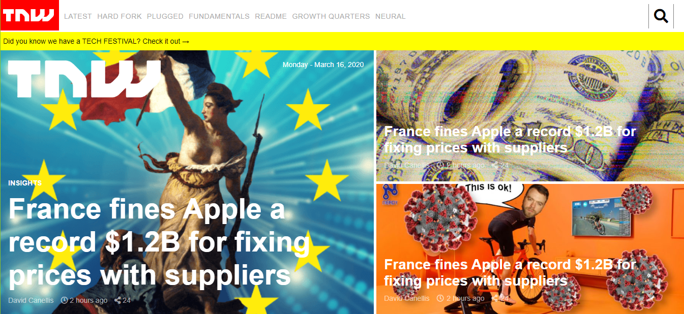

# Building with Responsive Design

## Copyrighted thenextweb.com

\*\_In this project, we have built a responsive website. We have cloned The Next Web, a tech-focused magazine which uses media queries to gracefully degrade their site as the window size is reduced. The process is quite similar to what we’ve done before.

> The next web

## Build With

- HTML,
- CSS

## Live Demo

[Live Demo Link](https://rawcdn.githack.com/Bekhzod96/theNextWeb/d3c0d784790e40d16899e252869040bb3d8ff14a/index.html)

**Deployment**:+1:

- \*_The page is very straightforward, so you should be able to clone it even if your CSS skills aren’t perfect. As usual, don’t worry about any of the dynamic functionality on the page or finding the specific icons they use or having the form actually submit. The point is to make it look like the real page as much as you reasonably can_

**npm run** to run server and page will be rendered automatically to Mozilla Developer Browser.

- Before to run you need to install all dependency by

**npm i** or **npm install**

## Authors

👤 **Erkin Sheraliev**

- GitHub:[@github/3rkeen](https://github.com/3rkeen)
- Twitter:[@twitter/3rkeen](https://twitter.com/3rkeen)
- Linkedin:[linkedin/ErkinSheraliev](https://www.linkedin.com/in/erkin-sheraliev-9122631a0/)

👤 **Bekhzod Akhrorov**

- Github:[@Bekhzod96](https://github.com/Bekhzod96)
- Twitter: [ @Begzod](https://twitter.com/25d47e8987f740b)
- Linkedin:[@Bekhzod AKhrorov](https://www.linkedin.com/in/bekhzod-akhrorov-b24232113/)

## 🤝 Contributing

**Contributions, issues and feature requests are welcome!**

## Show your support

Give a ⭐️ if you like this project!

## Acknowledgments

- Hat tip to anyone whose code was used
- Inspiration etc.

## 📝 License

This project is [MIT](lic.url) licensed.
